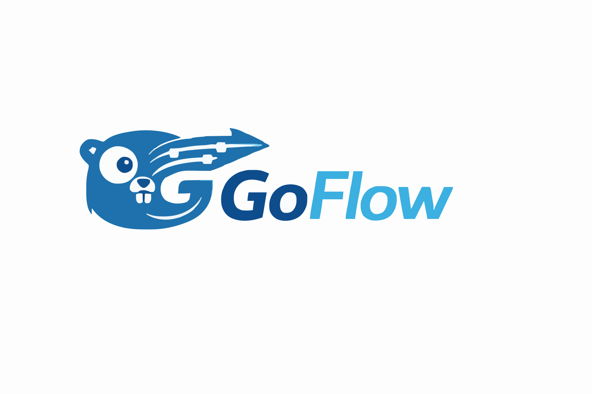
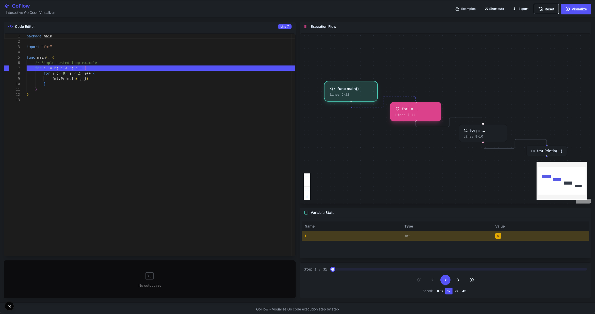

<p align="center">
  
</p>

<p align="center">
  An interactive web tool that visualizes Go code execution step-by-step, helping developers understand complex logic like nested loops and variable state changes through visual block diagrams.
</p>

<p align="center">
  
</p>

## Features

- **Monaco Code Editor**: Full-featured Go syntax highlighting and editing
- **Step-by-Step Execution**: Navigate through code execution with Next/Previous controls
- **Variable State Tracker**: Real-time display of all variable values at each step
- **Visual Flow Canvas**: React Flow-based diagram showing execution flow with highlighted active nodes
- **Console Output**: Real-time output from `fmt.Print` statements
- **Loop Visualization**: Nested loops displayed as container blocks with iteration tracking
- **Keyboard Shortcuts**: Full keyboard control for efficient navigation
- **Code Examples**: Built-in examples (Bubble Sort, Fibonacci, Factorial, etc.)
- **Export Trace**: Download execution trace as JSON for analysis

## Tech Stack

- **Frontend**: Next.js 14, React, TypeScript, Tailwind CSS, DaisyUI
- **Visualization**: React Flow (@xyflow/react)
- **Code Editor**: Monaco Editor (@monaco-editor/react)
- **Backend**: Go (Standard Library: go/ast, go/parser)
- **Execution**: AST-based interpreter for safe code simulation

## Getting Started

### Prerequisites

- Go 1.21+
- Node.js 18+
- npm

### Installation

```bash
# Clone the repository
git clone <repo-url>
cd go-code-visualizer

# Install dependencies
make install
```

### Running the Application

You need to run both the backend and frontend:

**Terminal 1 - Backend:**
```bash
make backend
# Or: cd backend && go run ./cmd/server
```

**Terminal 2 - Frontend:**
```bash
make frontend
# Or: cd frontend && npm run dev
```

Then open [http://localhost:3000](http://localhost:3000) in your browser.

## Usage

1. **Write or paste Go code** in the Monaco editor on the left
2. Click **"Visualize"** to analyze and trace the code
3. Use the **playback controls** to step through execution:
   - ⏮ Go to start
   - ◀ Previous step
   - ▶/⏸ Play/Pause auto-playback
   - ▶ Next step
   - ⏭ Go to end
4. Watch the **flow diagram** highlight the current execution point
5. Monitor **variable changes** in the state tracker (changed values pulse yellow)
6. View **console output** at the bottom left

## Keyboard Shortcuts

| Key | Action |
|-----|--------|
| `Space` | Play/Pause auto-playback |
| `←` / `→` | Previous/Next step |
| `Home` / `End` | Go to first/last step |
| `Shift+R` | Reset visualization |
| `Escape` | Stop playback |

## Project Structure

```
go-code-visualizer/
├── backend/
│   ├── cmd/server/          # Main server entry point
│   └── internal/
│       ├── tracer/          # AST parsing and analysis
│       └── executor/        # Code execution simulation
├── frontend/
│   └── src/
│       ├── app/             # Next.js app router
│       ├── components/      # React components
│       ├── hooks/           # Custom React hooks
│       ├── lib/             # API client
│       └── types/           # TypeScript types
└── docs/
    └── trace-schema.json    # JSON schema for trace data
```

## Supported Go Features

Currently supports:
- Variable declarations and assignments
- `for` loops (including nested)
- `if`/`else` statements
- `fmt.Print`, `fmt.Println`, `fmt.Printf`
- Basic arithmetic and comparison operations
- Integer, string, and boolean types

## API

### POST /api/trace

Analyze and trace Go code execution.

**Request:**
```json
{
  "code": "package main\n\nfunc main() {\n\t// your code\n}"
}
```

**Response:**
```json
{
  "success": true,
  "sourceCode": "...",
  "totalSteps": 10,
  "ast": { "nodes": [...] },
  "trace": [...],
  "finalOutput": "..."
}
```

## License

MIT
